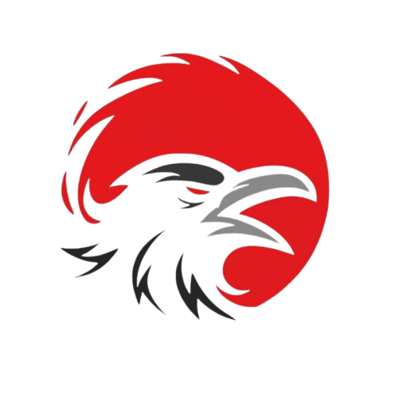

# ChaOS - Controlled Havoc for Red Teamers

A custom Linux distribution focused on privacy and red team operations, built on Debian with XFCE desktop environment.

## Overview

ChaOS is designed as a specialized Linux distribution for security professionals, penetration testers, and red team operators. It combines the stability of Debian with privacy-focused tools and a lightweight XFCE desktop environment.

## Features Planned
- A lightweight XFCE desktop environment
- Privacy-focused tools and configurations
- Pre-configured for red team operations
- Custom tools and scripts for red team engagements

